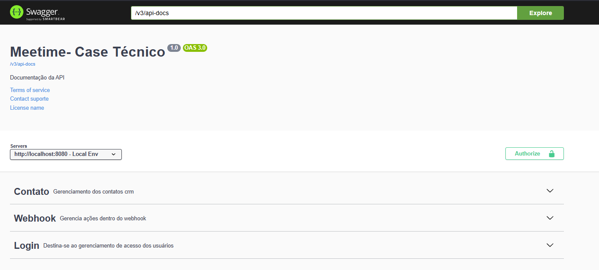

# Meetime Case Técnico Jeremias

Este repositório contém a integração com a API do HubSpot, utilizando OpenFeign para a comunicação com o webhook e Resilience4j para gerenciar o rate limit e a estratégia de retries. Siga as instruções abaixo para configurar e rodar o projeto.

---

---

## Passos para instalação

1. **Baixar e extrair o projeto:**
   Faça o download do projeto e extraia o conteúdo para o seu diretório local.

2. **Abrir o projeto:**
   Abra o projeto em um editor de sua preferência, como [VSCode](https://code.visualstudio.com/) ou [IntelliJ IDEA](https://www.jetbrains.com/idea/).

3. **Configuração do arquivo .env:**
   Crie um arquivo `.env` na raiz do projeto e adicione as variáveis necessárias, seguindo o exemplo do arquivo `sample.env`.

---

## Passos para habilitar o arquivo .env

### **VSCode**

1. Na aba de debug, crie um arquivo `launch.json` com o seguinte conteúdo para configurar o ambiente:

```json
{
  "version": "0.2.0",
  "configurations": [
    {
      "name": "Launch Program",
      "type": "java",
      "request": "launch",
      "mainClass": "com.example.Main",
      "envFile": "${workspaceFolder}/.env"
    }
  ]
}
```

## Passos para criação de conta e configuração do HubSpot para funcionamento do desafio técnico
### **Configuração:**

1. Acesse o [HubSpot Developer Portal](https://developers.hubspot.com)
2. Crie uma conta ou faça login se já tiver uma.
3. Após o login, crie um novo aplicativo na seção "Apps".
4. Configure o webhook para a sua API, fornecendo o endpoint correto para receber as chamadas.
5. Obtenha a chave de API (API Key) do HubSpot e adicione ao seu arquivo .env com a chave HUBSPOT_API_KEY.

## Decisões Técnicas

1. OpenFeign: A princípio, escolhi o OpenFeign para a comunicação com o webhook, pela facilidade de configuração e integração com o Spring.
O OpenFeign oferece uma maneira simples de consumir APIs RESTful, sendo ideal para esse tipo de integração.
2. Resilience4j para Rate Limiting e Retry: Para controlar o rate limit, tentativas e callbacks, optei por utilizar a dependência Resilience4j, 
que é uma biblioteca de tolerância a falhas e oferece suporte fácil para circuit breakers, retries, rate limiting e bulkheads.