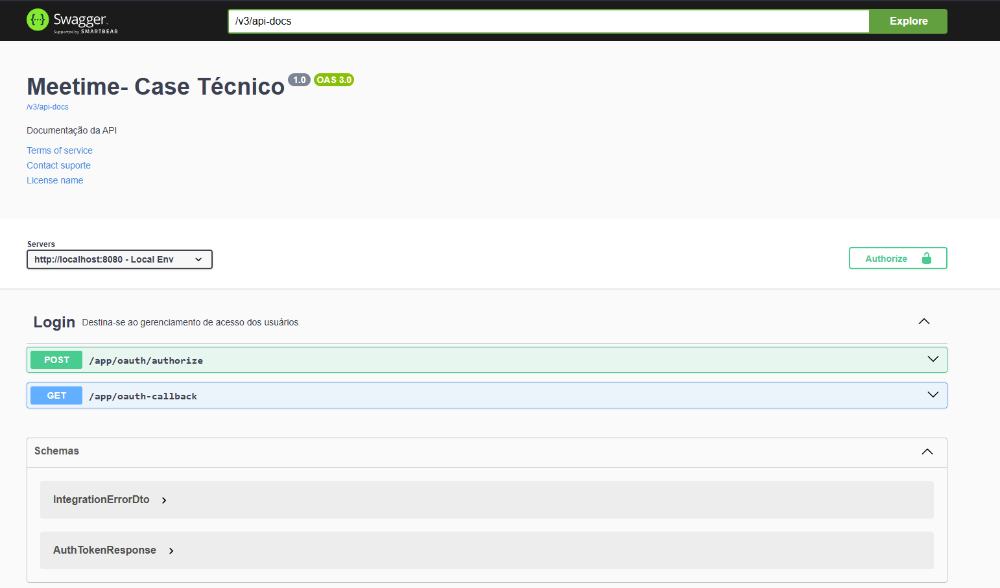
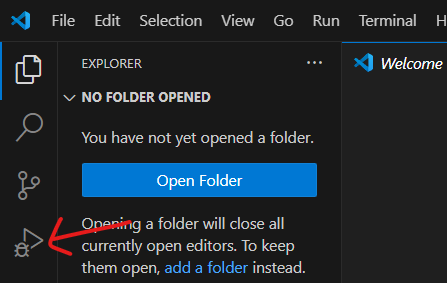
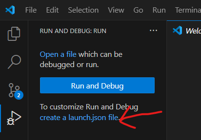
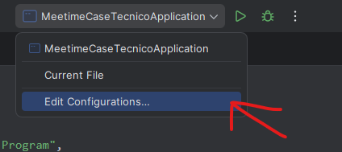
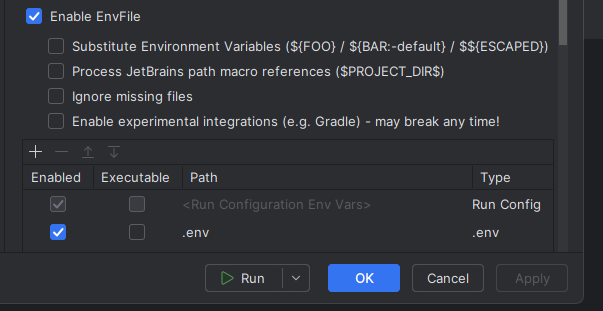
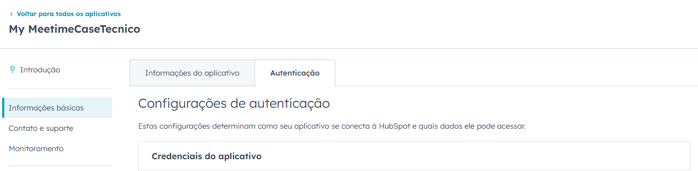
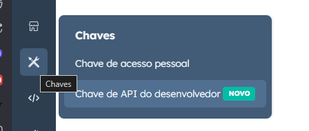

# Meetime Case Técnico Jeremias

Este repositório contém a integração com a API do HubSpot, utilizando OpenFeign para a comunicação com o webhook e Resilience4j para gerenciar o rate limit e a estratégia de retries. Siga as instruções abaixo para configurar e rodar o projeto.

## Swagger

 - url: http://localhost:8080/swagger-ui/index.html
---

---

## Passos para instalação

1. **Baixar e extrair o projeto:**
   Faça o download do projeto e extraia o conteúdo para o seu diretório local.

2. **Abrir o projeto:**
   Abra o projeto em um editor de sua preferência, como [VSCode](https://code.visualstudio.com/) ou [IntelliJ IDEA](https://www.jetbrains.com/idea/).

3. **Configuração do arquivo .env:**
   Crie um arquivo `.env` na raiz do projeto e adicione as variáveis necessárias, seguindo o exemplo do arquivo `sample.env`.

---

## Passos para habilitar o arquivo .env

### **VSCode**

1. Na aba de debug, crie um arquivo `launch.json` com o seguinte conteúdo para configurar o ambiente:

---

---

---

---

```json
{
  "version": "0.2.0",
  "configurations": [
    {
      "name": "Launch Program",
      "type": "java",
      "request": "launch",
      "mainClass": "com.example.Main",
      "envFile": "${workspaceFolder}/.env"
    }
  ]
}
```

### **Intellij Idea**

---

---

---

---

## Passos para criação de conta e configuração do HubSpot para funcionamento do desafio técnico
### **Configuração:**

1. Acesse o [HubSpot Developer Portal](https://developers.hubspot.com)
2. Crie uma conta ou faça login se já tiver uma.
3. Após o login, crie um novo aplicativo na seção "Apps".
4. Copie o clientId e clientSecret do seu app
---

---

5. Configure o webhook para a sua API, fornecendo o endpoint correto para receber as chamadas.
6. Obtenha a chave de API (API Key) do HubSpot e adicione ao seu arquivo .env com a chave HUBSPOT_API_KEY.

---

---

---

---

## Decisões Técnicas

1. OpenFeign: A princípio, escolhi o OpenFeign para a comunicação com o webhook, pela facilidade de configuração e integração com o Spring.
O OpenFeign oferece uma maneira simples de consumir APIs RESTful, sendo ideal para esse tipo de integração.
2. Resilience4j para Rate Limiting e Retry: Para controlar o rate limit, tentativas e callbacks, optei por utilizar a dependência Resilience4j, 
que é uma biblioteca de tolerância a falhas e oferece suporte fácil para circuit breakers, retries, rate limiting e bulkheads.
3. Optei por nao adicionar nenhuma dependencia de security como Spring Security ou Oauth2 pois o gerenciamento de acesso parte exclusivamente da hubspot
logo eu so precisei guardar de forma seguras as chaves de acesso
4. utilizando o AOP para  interceptações como logs, auditoria e evitar duplicidade de código

## Melhorias

1. Verificar melhor a questão do rate limit na documentação do hubspot sei que é possível porém achei um pouco complicado
2. Criação de um Dockerfile e docker-compose.yml
3. Validar se os pontos de rate limit e Circuit Breaker foram colocados nos lugares corretos e com configuração correta
4. Ter um dominio para teste (test.com.br) pois só fiz com base na documentação
5. Pensando em alta carga de requests e indisponibilidade a configuracao de uma fila (SQS,Kafka) ajudaria
ao sistema a guardar essa mensagem e quando volta-se fazer o processamento dela (considerando o endpoint de cadastro de contacts crm)

## Referências Utilizadas

- **OAuth Token**:  
  [Documentação sobre OAuth Tokens](https://developers.hubspot.com/docs/guides/api/app-management/oauth-tokens)

- **CRM Documentation**:  
  [Usando APIs de Objetos no CRM](https://developers.hubspot.com/docs/guides/api/crm/using-object-apis)  
  [Documentação sobre Objetos de Contatos](https://developers.hubspot.com/docs/guides/api/crm/objects/contacts)

- **Webhook Documentation**:  
  [Introdução aos Webhooks](https://developers.hubspot.com/docs/guides/api/app-management/webhooks)  
  [Referência de API para Webhooks](https://developers.hubspot.com/docs/reference/api/app-management/webhooks)  
  [Assinaturas de Webhooks](https://br.developers.hubspot.com/docs/reference/api/app-management/webhooks#post-%2Fwebhooks%2Fv3%2F%7Bappid%7D%2Fsubscriptions)  
  [Detalhes sobre Limitações de Uso](https://developers.hubspot.com/docs/guides/apps/api-usage/usage-details#rate-limits)

- **Scopes**:  
  [Link para Autorizar Scopes no HubSpot](https://app.hubspot.com/oauth/authorize?client_id=b0c0fca2-4f12-4e87-945f-e2d82f818f5d&redirect_uri=http://localhost&scope=oauth&optional_scope=crm.objects.contacts.write%20crm.objects.contacts.read)
